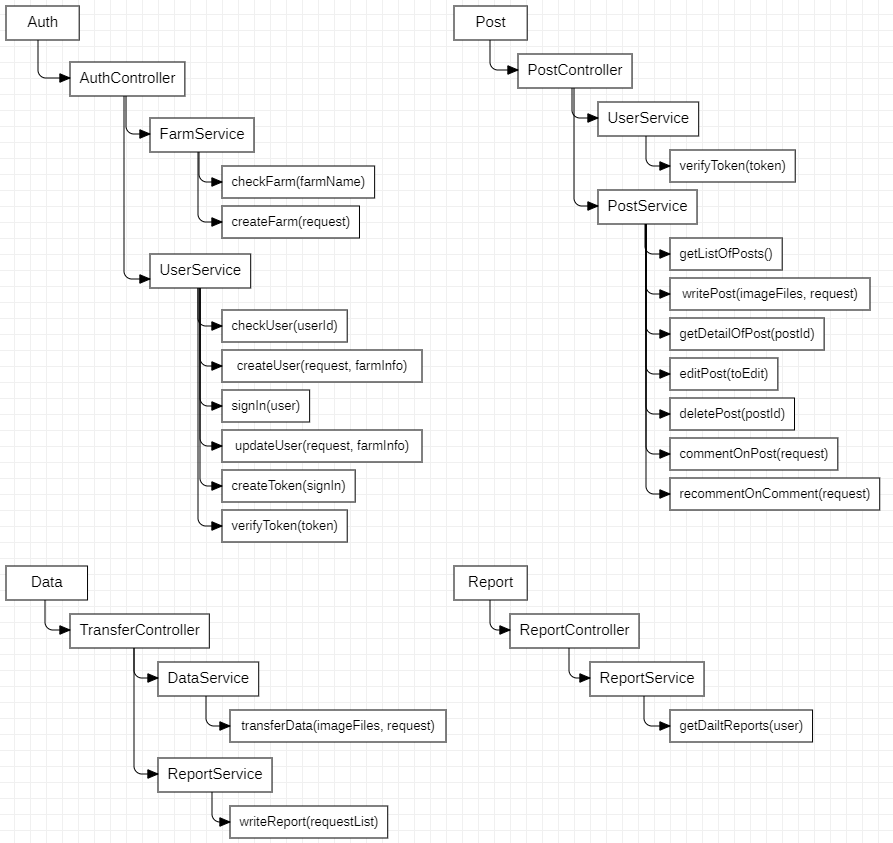
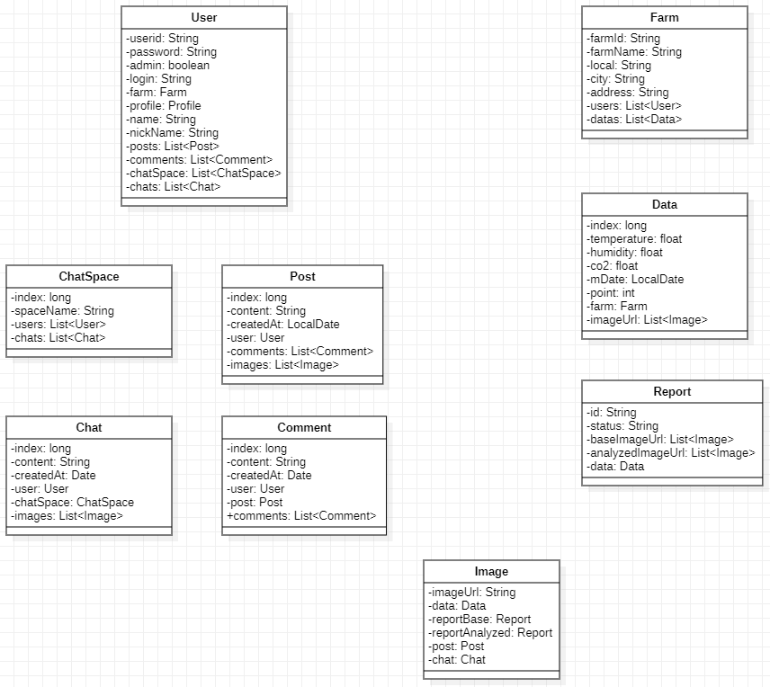

## WeBerry  
<a href="https://oxidized-sweater-1d3.notion.site/Weberry-4ca4eb31df96441da5b84eebc767af62">
&emsp;WeBerry 설명서
</a>
<h3>딸기 농가를 위한 맞춤 솔루션</h3>
<ul>
<li><strong>이미지 분석을 통한 성장 관리 시스템</strong></li>  
<li><strong>딸기 농가 간 정보 공유 웹어플리케이션</strong></li>
</ul>

## 🐘 팀원 소개  
&emsp;🧑‍💼이종수: 프로젝트 매니저, 풀스택 개발  
&emsp;🧑‍💼도은빈: 임베디드 개발, 프론트 디자인  
&emsp;🧑‍💼김다현: AI 모델 설계, 프론트 디자인  
&emsp;🧑‍💼변웅섭: 웹 와이어 프레임 설계, 프론트 디자인  
  
 
## :rabbit2:제품 및 사이트 구조 설계

<strong>Product Structure</strong>

<strong>Web Structure</strong>

 

## 🦒백엔드 플로우 차트

<strong>Java Class</strong>

 

## 👥엔터티

<strong>Java Class</strong>

<strong>RDBMS</strong>

 

## 🧨 Trouble Shooting

<strong>Backend</strong>

<ul>
 <li>
  <strong>multipart/form-data 바인딩 문제</strong>
  <ul>
   <li>각 언어별 request 방식이 조금씩 차이가 있어, 언어별 바인딩 방법에 맞게 해결.</li>
   <li>JavaScript의 경우, FormData 객체를 생성하고, 그 안에 key, value로 데이터를 연결. 여러개의 이미지를 하나의 이미지로 보낼시, list형식이 아니라 같은 key값에 append해야함. FormData 객체를 보낼 경우, header의 content-type을 multipart/form-data로 변경하지 않아도 자동으로 적용됨.</li>
   <li>python의 경우, requests 패키지를 사용, dictionary에 key, value를 담아 body에 담아서 송신. header의 content-type을 multipart/form-data로 변경해야함.</li>
  </ul>
 </li>
 <li>
  <strong>1:M 관계 중복 불가능 문제</strong>
  <ul>
   <li>Report와 Image의 1:M 관계에서 Report 클래스 안에 baseImageUrl, analyzedImageUrl 총 두번의 관계를 설정. sql상에는 둘다 연결된 것처럼 보이나, get할 경우, baseImageUrl에서 analyzedImageUrl이 얻어짐.</li>
   <li>1:M 관계를 하나의 클래스에서 다른 이름으로 2번 설정할 경우, 하나의 관계가 무효가 되는 현상이 있어, 관계를 imageUrls로 수정.</li>
  </ul>
 </li>
 <li>
  <strong>WebSocket 연결 간 데이터 송신 문제</strong>
  <ul>
   <li>ws 송수신 간 token을 통한 유저 유효성 검사를 위해 header에 token을 심어서 보내려고 했으나, ws 송신에서 header의 임의적인 수정이 불가능.</li>
   <li>ws 첫 송수신 과정에서 client의 첫 Message에 Token을 보내, 유효성 검사로 대체.</li>
  </ul>
 </li>
 <li>
  <strong>빌드 후, websocket 사용 문제</strong>
  <ul>
   <li>ws연결 실패 문제</li>
   <li>Backend Server CORS 주소 변경: lcoalhost >> 외부ip</li>
  </ul>
 </li>
</ul>

<strong>Frontend</strong>

<ul>
 <li>
  <strong>NextJS build 이후 image not found 문제</strong>
  <ul>
   <li>NextJS는 build 이후에 추가되는 public 폴더의 이미지를 불러오는게 불가능.</li>
   <li>이미지 저장을 NextJS의 public에 저장하는 방식에서 google cloud storage에 저장하고 불러오는 방식으로 전환.</li>
  </ul>
 </li>
 <li>
  <strong>댓글 작성 시간 문제</strong>
  <ul>
   <li>댓글 작성시, 현재 시간과 작성시간의 차이를 초로 계산해서 작성된 시간이 얼마전인지 확인하려 했으나 수천 시간 이전으로 발생.</li>
   <li>Ubuntu VM과 Mysql의 기본 설정시간이 UTF(+00:00)으로 설정되어 있어, timezone을 Asia/Seoul로 변경.</li>
  </ul>
 </li>
</ul>

<strong>Embeded</strong>

<ul>
 <li>
  <strong>Python 버전에 따른 PyTorch 임포트 에러 문제</strong>
  <ul>
   <li>Python3.9버전을 설치하여 작업하고 있었는데, PyTorch 패키지는 Python3.7 환경에서 동작하는 문제가 발생. Python3.7로 재설치하는 과정에서 라즈베리파이가 뻗어버려 먹통이 되는 이슈 발생.</li>
   <li>PyTorch를 사용하는 것 대신에 OpenCV에 모델을 태워 Flask Server에서 동작하는 방식으로 전환.</li>
  </ul>
 </li>
 <li>
  <strong>카메라 모듈 작동 시차 문제</strong>
  <ul>
   <li>RaspberryPi Camera 모듈 동작시 카메라를 켜고, 사진을 찍고, 카메라를 닫고, 데이터를 송신하는데 한 동작마다 3초의 딜레이가 발생.</li>
   <li>매 동작마다 카메라를 켜고 끄는 동작사이에 카메라로 찍고, RC카가 이동하는 코드를 삽입하여 딜레이 시간을 없앰.</li>
  </ul>
 </li>
</ul>

 
 
## 📚 STACK
Language : JAVA, Python, JavaScript, Linux
  
IDE : Eclipse, Vscode, GCP_SSH  
  
Library : Spring(backend_framework)  
&emsp;&emsp;&emsp;&nbsp;&nbsp;&nbsp;next.js(frontend_framework), modal, tailwindcss, useform  
&emsp;&emsp;&emsp;&nbsp;&nbsp;&nbsp;Flask(ai_framework), YOLOV5, OpenCV, GoogleCloudStorage  

DB : MySQL, H2
  
Dependencies: Spring Data JPA, Spring Web, H2, MySQL Driver, Lombok, JswWebToken
  
REST API(Tool): Postman
  

 

 
  
  
  
  
  
  
  
  
  
  
  
  
 

 
 
 
  
  
