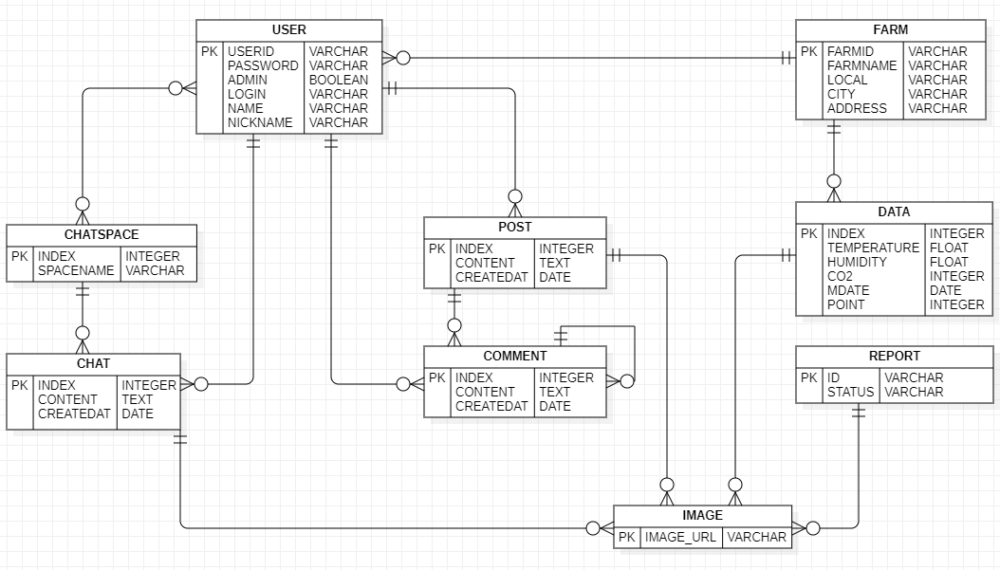

## WeBerry  
<h3>딸기 농가를 위한 맞춤 솔루션</h3>
<ul>
<li><strong>이미지 분석을 통한 성장 관리 시스템</strong></li>  
<li><strong>딸기 농가 간 정보 공유 웹어플리케이션</strong></li>
</ul>

## 🐘 팀원 소개  
&emsp;🧑‍💼이종수: 프로젝트 매니저, 풀스택 개발  
&emsp;🧑‍💼도은빈: 임베디드 개발, 프론트 디자인  
&emsp;🧑‍💼김다현: AI 모델 설계, 프론트 디자인  
&emsp;🧑‍💼변웅섭: 웹 와이어 프레임 설계, 프론트 디자인  
  
 
## :rabbit2:제품 및 사이트 구조 설계

<strong>Product Structure</strong>

<strong>Web Structure</strong>

 

## 🦒백엔드 플로우 차트

<strong>Java Class</strong>

 

## 👥엔터티

<strong>Java Class</strong>

<strong>RDBMS</strong>

 

## 🧨 Trouble Shooting
 

 
 
## 📚 STACK
Language : JAVA, Python, JavaScript, Linux
  
IDE : Eclipse, Vscode, GCP_SSH  
  
Library : Spring(backend_framework)  
&emsp;&emsp;&emsp;&nbsp;&nbsp;&nbsp;next.js(frontend_framework), modal, tailwindcss, useform  
&emsp;&emsp;&emsp;&nbsp;&nbsp;&nbsp;Flask(ai_framework), YOLOV5, OpenCV, GoogleCloudStorage  
  
DB : MySQL, H2
  
Dependencies: Spring Data JPA, Spring Web, H2, MySQL Driver, Lombok, JswWebToken
  
REST API(Tool): Postman
  

 

 
  
  
  
  
  
  
  
  
  
  
  
  
 

 
 
 
  
  
